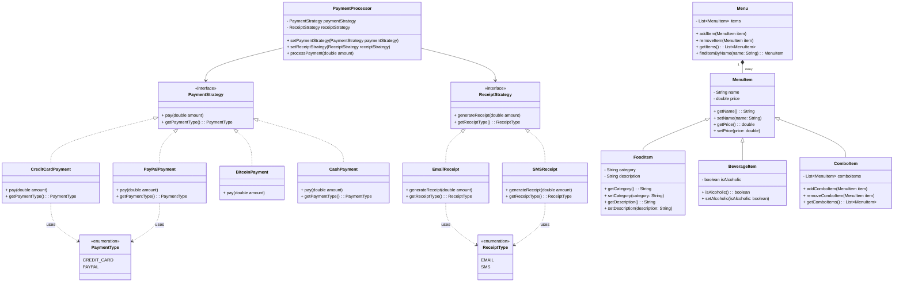

Code to practice java!

```mermaid
classDiagram
    class PaymentProcessor {
        - PaymentStrategy paymentStrategy
        - ReceiptStrategy receiptStrategy
        + setPaymentStrategy(PaymentStrategy paymentStrategy)
        + setReceiptStrategy(ReceiptStrategy receiptStrategy)
        + processPayment(double amount)
    }

    class PaymentStrategy {
        <<interface>>
        + pay(double amount)
        + getPaymentType() : PaymentType
    }

    class ReceiptStrategy {
        <<interface>>
        + generateReceipt(double amount)
        + getReceiptType() : ReceiptType

    }

    class CreditCardPayment {
        + pay(double amount)
        + getPaymentType() : PaymentType
    }

    class PayPalPayment {
        + pay(double amount)
        + getPaymentType() : PaymentType
    }

    class BitcoinPayment {
        + pay(double amount)
    }

    class CashPayment {
        + pay(double amount)
        + getPaymentType() : PaymentType
    }

    class EmailReceipt {
        + generateReceipt(double amount)
        + getReceiptType() : ReceiptType
    }

    class SMSReceipt {
        + generateReceipt(double amount)
        + getReceiptType() : ReceiptType
    }

    class PaymentType {
        <<enumeration>>
        CREDIT_CARD
        PAYPAL
    }

    class ReceiptType {
        <<enumeration>>
        EMAIL
        SMS
    }

    PaymentProcessor --> PaymentStrategy
    PaymentProcessor --> ReceiptStrategy

    PaymentStrategy <|.. CreditCardPayment
    PaymentStrategy <|.. PayPalPayment
    PaymentStrategy <|.. BitcoinPayment
    PaymentStrategy <|.. CashPayment

    ReceiptStrategy <|.. EmailReceipt
    ReceiptStrategy <|.. SMSReceipt


    CreditCardPayment ..> PaymentType : uses
    PayPalPayment ..> PaymentType : uses

    EmailReceipt ..> ReceiptType : uses
    SMSReceipt ..> ReceiptType : uses

    class Menu {
        - List~MenuItem~ items
        + addItem(MenuItem item)
        + removeItem(MenuItem item)
        + getItems() : List~MenuItem~
        + findItemByName(name: String) : MenuItem
    }

    class MenuItem {
        - String name
        - double price
        + getName() : String
        + setName(name: String)
        + getPrice() : double
        + setPrice(price: double)
    }

    class FoodItem {
        - String category
        - String description
        + getCategory() : String
        + setCategory(category: String)
        + getDescription() : String
        + setDescription(description: String)
    }

    class BeverageItem {
        - boolean isAlcoholic
        + isAlcoholic() : boolean
        + setAlcoholic(isAlcoholic: boolean)
    }

    class ComboItem {
        - List~MenuItem~ comboItems
        + addComboItem(MenuItem item)
        + removeComboItem(MenuItem item)
        + getComboItems() : List~MenuItem~
    }

    MenuItem <|-- FoodItem
    MenuItem <|-- BeverageItem
    MenuItem <|-- ComboItem
    Menu "1" *-- "many" MenuItem
```
